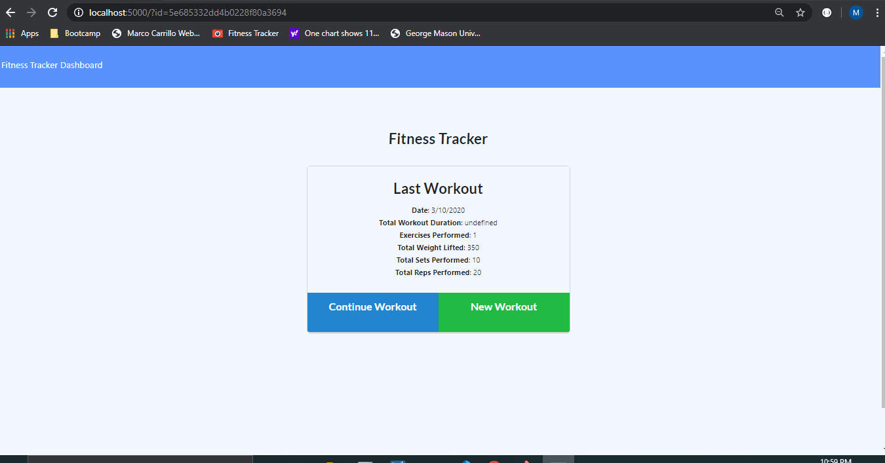

# Purpose of the application

The client-side has been provided, so that we can create the server side functionality to make this application work.

Even then, we have made modifications to the client side to make it work.

Overall, this is a workout tracker that keeps track of all of the workouts.  Each workout can have multiple exercises.  Each exercise can either be cardio or resistence.

Cardio exercises require the user to enter the name of the exercise, distance in miles and durations in minutes.

Resistance exercises require the user to enter the name of the exercise, the weight in pounds, the number of sets, the number of repetitions, and the duration in minutes.

## Access and client application behavior

Application has been deployed to https://xxxx.

When the client application starts, it will request the server for the last workout via the api GET "/api/workouts".  Once it starts, it will display that information together with the number of exercises for that last workout, and the aggregation of total weights lifted, total sets performed, total reps performed, and total distance covered.

The user has the ability then to add more exercises to the workout via the "Continue Workout" button , or to create a new workout.

##  Continue Workout 

The continue workout option allows the user to continue adding new exercises to the workout.

User enters the information about the new exercise, and then, the client requests the server to update the current document and add a new exercise to the array embeded in the current document of the workout collection.  

It does so by calling the PUT "api/workouts" route.

##  Create New Workout

The create new workout consists of two different actions:  1) Create an empty (no exercises) workout, and 2) add exercises to the workout.

Inmediately upon choosing this option, the client will ask the server to create a new document in our workout collection via the POST "api/workouts" route.

Then, it will ask the user to enter the exercise information, after which, it will ask the server to add the exercise to the workout via the PUT "api/workouts" route.

## Fitness Tracker Workout Dashboard

This workout has been modified from its original given how odd its original behavior.  It has been modified to provide the user with the statistics of the last seven workouts (generally one workout per day).

For those users that do two or more workouts per day, we recommend treating the workout as one throughout the day.

For users that skipped workouts during the days, the application will provide the last seven, regardless of how long ago it was.

If there are fewer than sever workouts, it will display only the number of workouts available.

For each workout, it will chart the total duration of all the individual exercises for that particular workout.

Additionally, it will chart the total pounds lifted by all of the individual exercises for that particular workout.

##  Overall application demonstration

